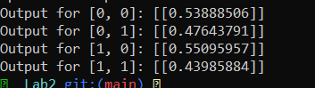
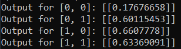
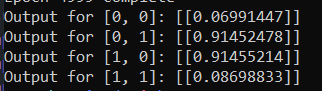
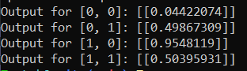
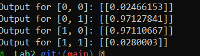

# Lab 2

So, this lab said to download the zip from here http://neuralnetworksanddeeplearning.com/

Couldn't see any zip so I went to ur man's github to get the network.py file https://github.com/mnielsen/neural-networks-and-deep-learning/blob/master/src/network.py

Question: Try to understand the code and relate back to concepts discussed in lectures i.e. the forward pass, computing the gradient, the backward pass, cross validation, and more

**Forward Pass**
- is where the input data is passed throguh the network to get output, done in function 
~~~python
def feelForward(self, a)

~~~
for each layer, it computes the dot prodyct of weights and activations from previous and adds biases

**Computing the Gradient**
the gradient is computed in the
~~~python 
def backprop(self, x, y):
~~~
it calcs the error at output ;ayer and propogates it backward through the network, layer by layer, It does it to determine how much each weight and biads contributed to the error

**Backward pass**

is where the gradients are used to update the wights and biases based on the errors computed during the forward pass

~~~python
def update_mini_batch(self, mini_batch, eta):
~~~

**Cross validation**
technique to asses how the results will generalise on an independent dataset. It's not in the code per say but theres a testing model after each epoch to validate performance of model on unseen data

in this method, the gradients are calculated from the backprop are used to update wights & biases for each mim batch of data
## Increasing the epochs

~~~ 
1000 epochs 
~~~

~~~ 
2000 epochs 
~~~

~~~ 
5000 epochs 
~~~

~~~ 
10000 epochs 
~~~

~~~ 
20000 epochs 
~~~

based on this, it got more accurate for 01, 10 but less accurate for 00 11